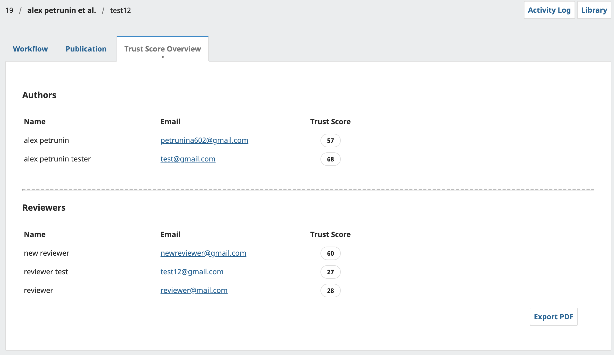

### Bona Fide Plugin and Backend

The **Bona Fide Plugin** is an OJS extension designed to enhance the workflow by integrating trust scoring functionality for authors and reviewers. It provides a user interface to display trust scores directly within the OJS backend, enabling editors to make informed decisions during the review process.

The **backend** is a FastAPI-based service that supports the plugin by handling the following key functionalities:
- **Bulk Verification**: Processes author and reviewer data to calculate trust scores.
- **PDF Export**: Generates trust score reports in PDF format for easy sharing and record-keeping.
- **Integration**: Communicates with the plugin via RESTful APIs to dynamically update trust scores.

Both components are containerized using Docker and integrated into the OJS system through Docker Compose for seamless deployment and scalability.

### Installation Instructions
1. OJS must be installed and running. [OJS Docker guide](https://github.com/pkp/docker-ojs). 
    - OJS version during development: OJS_VERSION=3_4_0-8
2. Clone the repository containing the Bona Fide Plugin and backend service into volumes/plugins/generic/ directory of your OJS installation.
3. Move backend service to the same directory as the `docker-compose.yml` file.
4. Update docker-compose.yaml to include the backend service:
```yaml
services:
  fastapi:
    build:
      context: ./backend
    container_name: fastapi
    ports:
      - "8000:8000"
    networks:
      - inside
```

### Directory Structure

```plaintext
.
└── OJS/
    └── journalName/
        ├── backend/
        │   ├── app.py
        │   └── Dockerfile
        ├── volumes/
        │   ├── ...
        │   ├── plugins/
        │   │   └── generic/
        │   │       └── trustScoreUI    # OJS dir extension for Bona Fide trust scoring
        │   └── ...
        └── docker-compose.yaml
```

### Preview
