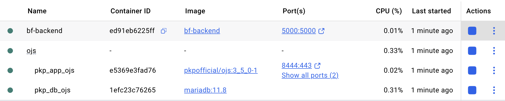
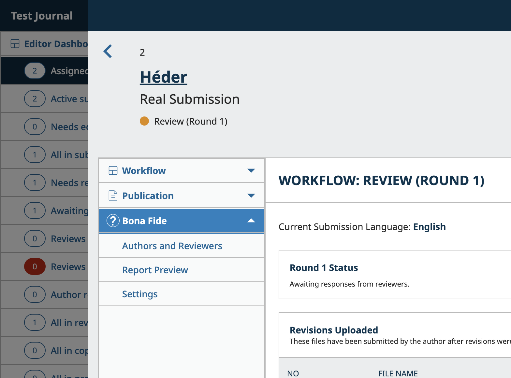
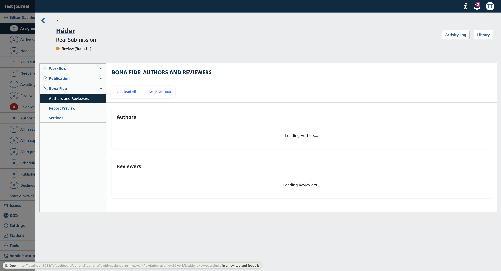
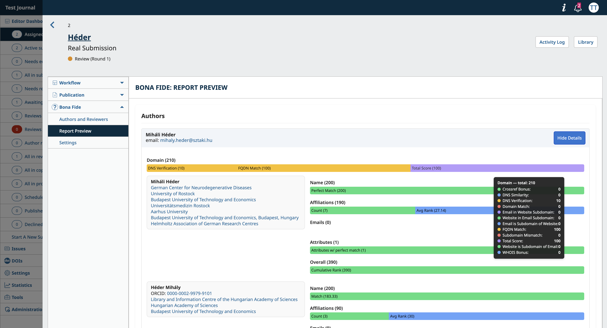
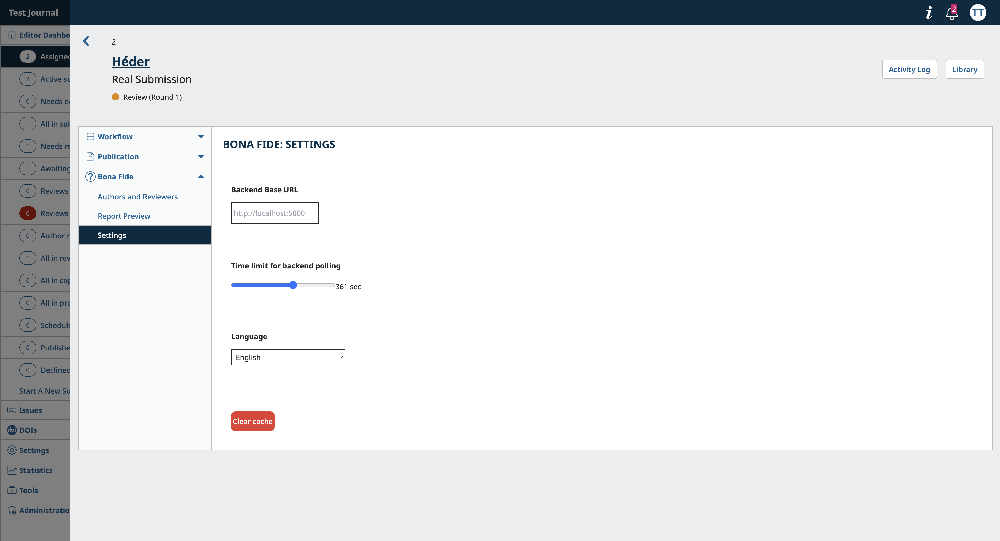

# Bona Fide Plugin

```
      |
  \  ___  /                           _________
 _  /   \  _    GÉANT                 |  * *  | Co-Funded by
    | ~ |       Trust & Identity      | *   * | the European
     \_/        Incubator             |__*_*__| Union
      =
```

The **Bona Fide Plugin** is an OJS extension designed to enhance the workflow of journal editors by integrating scoring functionality for authors and reviewers. It provides a user interface to display various scores directly within the OJS submission page, enabling editors to make informed decisions during the review process and mitigate manual overheads related to vetting the submission actors.

_Caution: during the plugin development for OJS v3.4.+ a migration to a newer v3.5.+ occured. You can still find the older version plugin branch with hooks usage and custom JS UI embedding examples, but it is considered obsolete._

## Two ways of plugin installation in the OJS system
**For plugin developers:** it is more suitable to streamline the development experience with Docker Compose and volume mounts.

**For plugin final users:** usually, the production environment for OJS is not a Docker setup, therefore native OJS plugin upload with zip archive is a way to go.


### 1. Docker Compose setup for OJS v3.5.+ plugin development

**Quick DX overview:** there are 3 components developers need:
1. General PKP Dockerized setup, tuned for OJS tool.
2. Your plugin development environment with a separate repository in VCS. This is what we will mount as a volume to the 1st component.
3. Backend with scoring business logic.

Below these components will be referenced as C1, C2, C3 respectively. Assume C1,C2,C3 are on the same directory level.

#### 1.1. OJS system containerized setup (C1)
-  [Installation guide](https://github.com/pkp/containers)
- In docker-compose.yml of C1, add C2 location to services.app.volumes section:
```yaml
services:
  app:
    volumes:
      - ../C2/plugin-name:/var/www/html/plugins/generic/plugin-name    # in our case plugin-name is trustScoreUI
```

#### 1.2. OJS plugin embedding and Development (C2)
1. OJS v3.5.+ is using [Vue3](https://vuejs.org/), allowing for huge customization opportunities. [OJS 3.5 release notebook](https://docs.pkp.sfu.ca/dev/release-notebooks/en/3.5-release-notebook)
1. Frontend tooling standard: [Vite](https://vite.dev/)

- plugin directory must be mounted to OJS system if we want to see instant live updates

```bash
cd ../C2/plugin-name
npm install
npm run watch # build and live update on code changes
```

#### 1.3. Backend (C3)
- [Bona Fide Backend](https://github.com/PeterBolha/bona-fide-researcher)

Build and run with commands:
```bash
docker build -t bf-backend .
docker run -d -p 5000:5000 --name bf-backend bf-backend
```

### 2. Zip archive artefact
**Quick usage overview:** Plugin upload to OJS is as simple as dropping a zip archive of the plugin in the website settings. For the final zip archive you need:
1. build artefact for plugin - vite compiled results inside `plugin-name/dist/` folder;
2. php plugin injection wrapper, e.g. `PluginNamePlugin.php`;
3. `version.xml` that stores plugin metadata
#### 2.1. Plugin artefact generation
Compose a folder (e.g. `artefacts/`) with necessary files and run:
```bash
tar -czvf plugin-name.tar.gz artefacts/
```
#### 2.2. Plugin upload to OJS website options
- Brand new: On your OJS website go to `Settings > Website > Plugins > Upload A New Plugin` and drop the zip there.
- Upgrade: change version.xml with new metadata > generate new file > "Upgrade" via option of the plugin followign `Settings > Website > Plugins`.
- Reupload: delete plugin and upload as brand new without version change.

## Related projects
This plugin integrates with other components developed as parts of the GÉANT Trust & Identity Incubator. The scoring business logic is implemented on the backend side in [this GitHub repository](https://github.com/PeterBolha/bona-fide-researcher). The Bona Fide OJS plugin could be used as an example of a custom [PKP OJS generic plugin extension](https://docs.pkp.sfu.ca/plugin-inventory/en/).

# Preview
### Local docker setup: C1 and C3:


### New custom tab for submission:


### Authors and Reviewers Tab:


### Report Preview Tab:


### Settings Tab:

